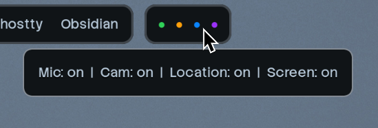

# Privacy Dots
  
Displays the status of your microphone, camera, and location with beautiful colored dots.



## Capabilities

- **Mic Status:** Shows a green dot when any microphone is in use.
- **Cam Status:** Shows an orange dot when any camera is active.
- **Loc Status:** Shows a blue dot when location services are in use.
- **Easy to Customize:** Add new statuses or change colors easily. The functionality is handled by a simple Bash script, and styling is managed with CSS.

## Defaults

The backend script polls status information every 3 seconds by default. It provides formatted text, tooltips, and styling classes, which you can use with any bar to display. As I use Waybar, its guide is the only one that's present.

## Installation for Waybar

1. Download the script and place it into your scripts folder: [privacy_dots.sh](https://github.com/alvaniss/privacy-dots/blob/main/privacy_dots.sh)

2. Add the module to your waybar config:

```jsonc
{
    "custom/privacydots": {
        "exec": "/path/to/script/privacydots.sh",
        "return-type": "json",
        "interval": 3,
        "format": "{text}",
        "tooltip": true,
        "escape": false,
        "markup": "pango"
    }
}
```

3. Add this module style to `~/.config/waybar/style.css` (optional):

```css
#custom-privacydots {
  padding: 0 10px;
  font-size: 12px;
  letter-spacing: 3px;
}
```
